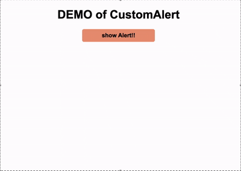

JavaScript  
# CustomAlert  

このUIライブラリを使用するとアラートのボタンの色を変更できます  
ブラウザのデフォルトの挙動を無視できるので、ブラウザ標準の機能ではもの足りないときや標準の挙動だとバグが起きやすいときに使用できます  
言語は、日本語、英語、中国語に対応しています  
(ブラウザの言語設定によって、自動で変更されます)  
注) このライブラリを使う場合、file:直接アクセスではなくサーバーを介して開かないと動きません  
(ブラウザの挙動によるバグも防ぐことができます)  

## Topics  

- ### Sample  
    <a href="./Sample.md" target="_blank">Sample</a>  

- ### QuickStart  
    <a href="./QuickStart.md" target="_blank">QuickStart</a>  

- ### API Reference  
    <a href="./APIReference.md" target="_blank">API Reference</a>  

